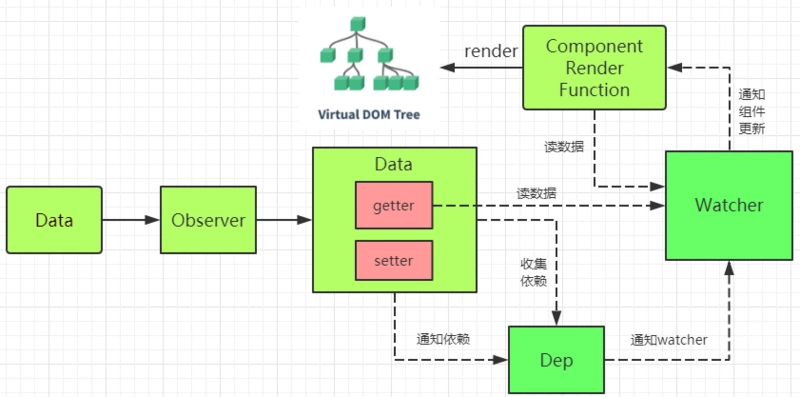

# Vue源码解析之数据响应式原理

* Observer、Watcher、Dep 3个类的连接形式关系，实现对象的递归侦测、数组的变化侦测

* [From vue.js](https://vuejs.org/v2/guide/reactivity.html)

* [From CSDN](https://blog.csdn.net/Mikon_0703/article/details/111367773)

